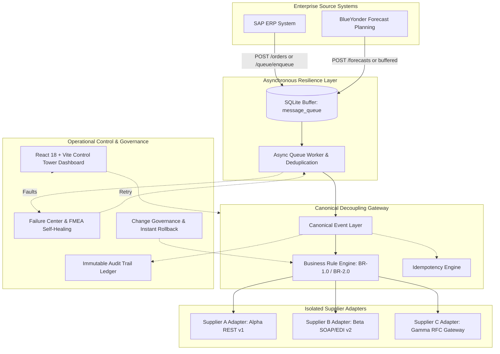

# Integration Control Tower: Decoupled Manufacturing Gateway

> **Empirical Architecture Prototype**: Manufacturer Exchanging Orders and Forecasts with Multi-Supplier Adapters.  
> **Core Architectural Result**: Demonstrating an **83.3% blast-radius reduction** (from 6 point-to-point systems down to 1 canonical component) with asynchronous resilience buffering and explicit schema contracts.  
> **Verified Automated Test Suite**: **26 of 26 tests passed** (0 failures, 0 regressions).

---

## 1. Project Architecture

The **Integration Control Tower** is an enterprise architecture pilot designed to decouple high-volume Purchase Order and Demand Forecast integration between internal planning systems (**SAP S/4HANA ERP**, **BlueYonder Forecast Planning**) and component suppliers:
- **Supplier A (Alpha Components Ltd.)**: Fasteners & Spindle Hardware (REST JSON)
- **Supplier B (Beta Manufacturing Corp)**: Servo Motors & Housings (SOAP / EDI JSON)
- **Supplier C (Gamma Parts GmbH)**: Hydraulic Valves & Precision Seals (SAP RFC Gateway JSON)

### Architectural Components



1. **React + Vite Frontend (`frontend/`)**: Single-page administrative dashboard and control tower built with React 18, TypeScript 5, Vite 5, and Vanilla CSS. Provides interactive monitors for orders, forecasts, canonical events, side-by-side adapter transformations, queue metrics, failure simulation/recovery, and rollback management.
2. **FastAPI Backend (`backend/app/`)**: High-performance REST gateway and canonical event processor built with FastAPI and Python 3.12. Coordinates validation, canonicalization, adapter dispatch, and rule deployment.
3. **SQLite Database (`backend/integration_pilot.db`)**: Local ACID-compliant database managed via SQLAlchemy 2.0 ORM with zero external server dependencies.
4. **Canonical Event Layer (`backend/app/services/canonical_event_service.py`)**: Centralized normalization and business rule evaluation engine. Evaluates business rules (such as **CR-001**: urgent orders with quantity &ge; threshold marked `PRIORITY_HIGH`).
5. **Supplier Adapters (`backend/app/adapters/`)**: Fully isolated adapter implementations for Supplier A, Supplier B, and Supplier C. Each adapter encapsulates wire-format transformations, explicit Pydantic schema contracts, and simulated transport.
6. **Asynchronous Message Queue (`backend/app/services/queue_service.py`)**: SQLite-backed asynchronous queue and delay buffer (`message_queue` table). Buffers traffic during upstream system delays, intercepts transient failures, and manages automatic retries.
7. **Failure Center (`backend/app/services/failure_service.py`)**: FMEA failure tracking, dynamic failure simulation, operator retry triggering, and self-healing resolution.
8. **Audit Trail (`backend/app/services/audit_service.py`)**: Append-only audit ledger recording every lifecycle action, state change, and correlation ID.
9. **Rollback & Change Management (`backend/app/services/change_service.py`, `rollback_service.py`)**: Multi-stage governance workflow (Draft &rarr; Review &rarr; Approve &rarr; Deploy) with single-call emergency rollback.

---

## 2. Setup and Run Instructions

### Prerequisites
- **Python**: Version 3.11+ (Validated on Python 3.12.8)
- **Node.js**: Version 18+ (Validated on Node v20.18.0)
- **PowerShell / Bash / CMD**

### Option A: Quick-Start Batch Scripts (Windows)
```powershell
# 1. Start Backend (Initializes venv, installs dependencies, seeds SQLite, starts FastAPI on :8000)
.\start_backend.bat

# 2. Start Frontend (Installs npm dependencies, launches Vite dev server on :5173)
.\start_frontend.bat
```

### Option B: Manual Command-Line Execution

#### 1. Backend Setup & Run
```powershell
cd backend

# Create and activate virtual environment
python -m venv .venv
.\.venv\Scripts\Activate.ps1

# Install backend dependencies
pip install -r requirements.txt

# Run the FastAPI server (runs on http://127.0.0.1:8000)
python run.py
```

#### 2. Frontend Setup & Run
```powershell
cd frontend

# Install node dependencies
npm install

# Run Vite development server (runs on http://localhost:5173)
npm run dev

# Or build production bundle
npm run build
```

#### 3. Automated Test Execution
```powershell
cd backend

# Run the complete test suite (26 tests)
.\.venv\Scripts\pytest -v
```

---

## 3. API Documentation

The FastAPI gateway exposes modular REST endpoints with interactive documentation available at `http://127.0.0.1:8000/docs` (Swagger UI) and `http://127.0.0.1:8000/redoc`.

### 3.1. Orders Endpoints (`/api/orders`)
- **`GET /api/orders`**
  - **Purpose**: Lists all purchase orders with optional supplier filtering.
  - **Parameters**: `supplier_id` (optional string), `limit` (int, default 100).
  - **Response**: Array of `OrderResponse` objects ordered by creation date descending.
- **`POST /api/orders`**
  - **Purpose**: Ingests an order from ERP, persists it, generates a `CanonicalEvent`, and dispatches to the target supplier adapter. Buffers into the queue if ERP is in `DELAYED` status.
  - **Request Body**: `OrderCreate` (`supplier_id`, `product_id`, `quantity`, `delivery_date`, `is_urgent`, `unit`, `source_system`).
  - **Response**: HTTP 201 with created `OrderResponse`. Returns HTTP 422 if quantity &le; 0.

### 3.2. Forecasts Endpoints (`/api/forecasts`)
- **`GET /api/forecasts`**
  - **Purpose**: Lists demand forecasts with optional supplier filtering.
  - **Parameters**: `supplier_id` (optional string), `limit` (int, default 100).
  - **Response**: Array of `ForecastResponse` objects.
- **`POST /api/forecasts`**
  - **Purpose**: Ingests a demand forecast. If the forecast planning feed is delayed, records state as `DELAYED` and buffers into the message queue without blocking the system.
  - **Request Body**: `ForecastCreate` (`supplier_id`, `product_id`, `forecast_quantity`, `forecast_period`, `confidence_level`).
  - **Response**: HTTP 201 with `ForecastResponse`.

### 3.3. Canonical Events Endpoints (`/api/events`)
- **`GET /api/events`**
  - **Purpose**: Lists canonical events normalized across all systems.
  - **Parameters**: `event_type`, `supplier_id`, `status`, `limit`.
  - **Response**: Array of `CanonicalEventResponse` objects.
- **`GET /api/events/{event_id}`**
  - **Purpose**: Retrieves a single canonical event by ID.
  - **Response**: `CanonicalEventResponse` or HTTP 404.
- **`POST /api/events/process`**
  - **Purpose**: Manually triggers batch processing and adapter dispatch for all pending/retrying canonical events.
  - **Response**: JSON summary of processed count.

### 3.4. Adapters Endpoints (`/api/adapters`)
- **`GET /api/adapters`**
  - **Purpose**: Lists delivery records and status across all supplier adapters.
  - **Parameters**: `supplier_id`, `status`, `limit`.
  - **Response**: Array of `AdapterDeliveryResponse` objects.
- **`GET /api/adapters/compare-transformations`**
  - **Purpose**: Renders side-by-side comparison of how a canonical event maps into Alpha REST v1, Beta SOAP/EDI v2, and Gamma SAP RFC JSON formats.
  - **Parameters**: `event_id` (optional).
  - **Response**: JSON containing the canonical event and transformed payloads for all 3 suppliers.
- **`GET /api/adapters/contracts`**
  - **Purpose**: Exposes explicit schema contracts, required fields, and mapping specifications for all 3 suppliers.
  - **Response**: JSON array of contract specifications.
- **`POST /api/adapters/validate`**
  - **Purpose**: Validates a supplier message payload against the supplier's explicit schema contract without persisting.
  - **Request Body**: `SupplierValidationRequest` (`supplier_code`, `payload`).
  - **Response**: `SupplierValidationResponse` (`valid: bool`, `message`, `errors`, `canonical_preview`).
- **`POST /api/adapters/{supplier_code}/ingest`**
  - **Purpose**: Direct ingestion of supplier message in proprietary format. Rejects invalid messages with HTTP 422; transforms valid messages into canonical format.
  - **Parameters/Body**: `supplier_code` (path: `SUP-A`, `SUP-B`, `SUP-C`), JSON payload (body).
  - **Response**: HTTP 200 with `status="ACCEPTED"` and assigned `canonical_event_id`.
- **`POST /api/adapters/retry/{delivery_id}`**
  - **Purpose**: Retries a failed adapter wire transmission.
  - **Response**: Updated `AdapterDeliveryResponse` (`PROCESSED` or `FAILED`).

### 3.5. Queue Endpoints (`/api/queue`)
- **`GET /api/queue`**
  - **Purpose**: Lists messages in the asynchronous queue / buffer.
  - **Parameters**: `status`, `topic`, `limit`.
  - **Response**: Array of `QueuedMessageResponse` objects.
- **`GET /api/queue/stats`**
  - **Purpose**: Returns queue metrics breakdown (`total`, `queued`, `processing`, `processed`, `retrying`, `failed`, `dead_letter`).
  - **Response**: `QueueStatsResponse`.
- **`POST /api/queue/enqueue`**
  - **Purpose**: Enqueues a message with idempotency deduplication.
  - **Request Body**: `QueuedMessageCreate` (`topic`, `payload`, `idempotency_key`, `source_system`, `correlation_id`).
  - **Response**: HTTP 201 with `QueuedMessageResponse`.
- **`POST /api/queue/process/{queue_id}`**
  - **Purpose**: Triggers processing of a specific queued message with optional failure simulation.
  - **Parameters**: `queue_id` (path), `simulate_failure` (query bool).
  - **Response**: `QueueProcessResponse`.
- **`POST /api/queue/retry/{queue_id}`**
  - **Purpose**: Retries a failed or retrying message; resolves associated Failure Center cases upon success.
  - **Response**: `QueueProcessResponse`.
- **`POST /api/queue/process-all`**
  - **Purpose**: Drains all pending/retrying messages in FIFO order.
  - **Response**: JSON report with total attempted, processed count, and failed count.

### 3.6. Failures Endpoints (`/api/failures`)
- **`GET /api/failures`**
  - **Purpose**: Lists FMEA failure records.
  - **Parameters**: `status`, `severity`, `limit`.
  - **Response**: Array of `FailureCaseResponse`.
- **`POST /api/failures/simulate`**
  - **Purpose**: Dynamically simulates one of 5 failure modes (`MISSING_DATA`, `DELAYED_DATA`, `SCHEMA_VIOLATION`, `ENDPOINT_UNAVAILABLE`, `DUPLICATE_EVENT`).
  - **Request Body**: `FailureSimulateRequest` (`failure_type`, `target_system`).
  - **Response**: Created `FailureCaseResponse` with `status="OPEN"`.
- **`POST /api/failures/{failure_id}/retry`**
  - **Purpose**: Triggers recovery attempt on an open failure case.
  - **Response**: `FailureCaseResponse` with updated status and incremented `retry_count`.
- **`POST /api/failures/{failure_id}/resolve`**
  - **Purpose**: Manually marks a failure case as `RESOLVED`.
  - **Response**: `FailureCaseResponse`.

### 3.7. Change Requests & Rollback Endpoints (`/api/changes`, `/api/rollback`)
- **`GET /api/changes`** — Lists all Change Requests (e.g. CR-001).
- **`GET /api/changes/{change_id}`** — Gets Change Request by ID.
- **`POST /api/changes`** — Creates new Change Request (HTTP 201).
- **`POST /api/changes/{change_id}/submit`** — Submits change for review.
- **`POST /api/changes/{change_id}/approve`** — Governance approval gate.
- **`POST /api/changes/{change_id}/reject`** — Rejects change request.
- **`POST /api/changes/{change_id}/deploy`** — Deploys rule change (`BR-2.0`, threshold 200).
- **`POST /api/changes/{change_id}/rollback`** — Rolls back change to previous rule (`BR-1.0`, threshold 100).
- **`GET /api/rollback`** — Lists all executed rollback actions.
- **`POST /api/rollback`** — Triggers audited emergency rollback.

### 3.8. Audit, Systems & Experiments Endpoints
- **`GET /api/audit`** — Queries append-only audit trail (`action`, `entity_type`, `status`, `search`, `limit`).
- **`GET /api/systems`** — Live status and latency of integrated systems.
- **`POST /api/systems/simulate`** — Modifies system status (`ONLINE`, `DELAYED`, `OFFLINE`).
- **`POST /api/systems/recover-all`** — Recovers all systems to `ONLINE`.
- **`GET /api/experiments`** — Lists decoupling experiment runs.
- **`GET /api/experiments/metrics`** — Returns blast-radius reduction comparison (83.3%).
- **`POST /api/experiments/run`** — Executes decoupling benchmark simulation.
- **`GET /api/validation`** & **`GET /api/validation/summary`** — Stakeholder review scores.
- **`GET /api/health`** — Subsystem health check.

---

## 4. Database Schema (SQLite / SQLAlchemy)

The application uses SQLite (`backend/integration_pilot.db`) with 14 SQLAlchemy models defined in `backend/app/models.py`.

| Model Name | Table Name | Key Fields | Purpose | Relationships |
| :--- | :--- | :--- | :--- | :--- |
| **`Manufacturer`** | `manufacturers` | `id`, `name`, `code`, `erp_system_name`, `forecast_system_name`, `location`, `created_at` | Enterprise manufacturer entity profile. | None |
| **`Supplier`** | `suppliers` | `id`, `code` (Unique), `name`, `endpoint_url`, `format_type`, `is_active`, `created_at` | External component supplier profile and format specs. | `orders`, `forecasts` |
| **`Order`** | `orders` | `id`, `order_id` (Unique), `supplier_id` (FK: `suppliers.code`), `product_id`, `quantity`, `unit`, `is_urgent`, `delivery_date`, `source_system`, `status`, `correlation_id`, `created_at` | Purchase orders originating from ERP. | `supplier` (Many-to-One) |
| **`Forecast`** | `forecasts` | `id`, `forecast_id` (Unique), `supplier_id` (FK: `suppliers.code`), `product_id`, `forecast_quantity`, `forecast_period`, `source_system`, `confidence_level`, `status`, `correlation_id`, `created_at` | Demand forecasts originating from planning systems. | `supplier` (Many-to-One) |
| **`CanonicalEvent`** | `canonical_events` | `id`, `event_id` (Unique), `event_type`, `event_version`, `source_system`, `order_id`, `forecast_id`, `supplier_id`, `product_id`, `quantity`, `unit`, `priority`, `delivery_date`, `forecast_period`, `business_rule_version`, `correlation_id`, `idempotency_key` (Unique), `status`, `raw_payload` (JSON), `created_at` | Normalized canonical event representation. Evaluates business rules and deduplication. | `deliveries` (One-to-Many) |
| **`AdapterDelivery`** | `adapter_deliveries` | `id`, `delivery_id` (Unique), `event_id` (FK: `canonical_events.event_id`), `supplier_id`, `adapter_name`, `transformed_payload` (JSON), `delivery_status`, `attempt_count`, `last_attempt`, `error_message`, `latency_ms`, `retry_status`, `created_at` | Outbound wire transmission attempts and responses per supplier. | `canonical_event` (Many-to-One) |
| **`SystemStatus`** | `system_statuses` | `id`, `system_name` (Unique), `display_name`, `system_type`, `status`, `latency_ms`, `error_rate`, `last_heartbeat`, `details` | Live health, latency, and failure simulation status of integrated systems. | None |
| **`FailureCase`** | `failure_cases` | `id`, `failure_id` (Unique), `failure_type`, `affected_system`, `severity`, `cause`, `impact`, `detection_method`, `recovery_action`, `status`, `retry_count`, `audit_reference`, `created_at`, `resolved_at` | FMEA failure tracking, simulation, and self-healing resolution. | None |
| **`ChangeRequest`** | `change_requests` | `id`, `change_id` (Unique), `title`, `description`, `rule_key`, `current_rule_version`, `proposed_rule_version`, `previous_threshold`, `new_threshold`, `status`, `submitted_by`, `approved_by`, `deployed_at`, `rolled_back_at`, `baseline_systems_changed`, `decoupled_systems_changed`, `notes`, `created_at` | Change governance lifecycle for business rules (CR-001). | None |
| **`AuditEntry`** | `audit_entries` | `id`, `audit_id` (Unique), `timestamp`, `actor`, `action`, `entity_type`, `entity_id`, `old_value`, `new_value`, `status`, `correlation_id` | Immutable append-only audit trail ledger for traceability. | None |
| **`RollbackAction`** | `rollback_actions` | `id`, `rollback_id` (Unique), `change_id` (FK: `change_requests.change_id`), `from_version`, `to_version`, `initiated_by`, `reason`, `status`, `timestamp` | Emergency rollback execution record. | None |
| **`ExperimentRun`** | `experiment_runs` | `id`, `run_id` (Unique), `timestamp`, `rule_change_name`, `baseline_systems_changed`, `decoupled_systems_changed`, `baseline_effort_hours`, `decoupled_effort_hours`, `tests_required_baseline`, `tests_required_decoupled`, `risk_score_baseline`, `risk_score_decoupled`, `improvement_pct`, `notes` | Decoupling benchmark run records (83.3% blast-radius reduction). | None |
| **`StakeholderValidation`** | `stakeholder_validations` | `id`, `respondent_name`, `respondent_role`, `score_flow`, `score_health`, `score_recovery`, `score_change`, `score_rollback`, `score_decoupling`, `comments`, `is_simulated`, `created_at` | Architectural feedback scorecard. | None |
| **`MessageQueueItem`** | `message_queue` | `id`, `queue_id` (Unique), `topic`, `payload` (JSON), `idempotency_key` (Indexed), `status`, `retry_count`, `max_retries`, `error_message`, `source_system`, `correlation_id`, `created_at`, `processed_at` | Asynchronous message queue and resilience buffer. | None |

---

## 5. Automated Test Suite Documentation

### Running Tests
```powershell
cd backend
.\.venv\Scripts\pytest -v
```

### Verified Test Suite Breakdown (26 Tests Passed)
The complete test suite is divided into 10 test modules:

1. **`tests/test_health.py` (1 test)**
   - `test_health_check_endpoint`: Verifies `/api/health` returns HTTP 200 with `status="HEALTHY"` and all subsystem checks nominal.
2. **`tests/test_orders.py` (3 tests)**
   - `test_create_order_and_canonical_event`: Verifies order ingestion from ERP, canonicalization, and `PRIORITY_HIGH` rule resolution when urgent and quantity &ge; 100.
   - `test_create_urgent_order_below_threshold`: Verifies urgent order below threshold (80 < 100) resolves to `NORMAL` priority.
   - `test_order_validation_failure`: Verifies Pydantic validation error boundary (HTTP 422) on negative quantity.
3. **`tests/test_forecasts.py` (2 tests)**
   - `test_create_forecast`: Verifies demand forecast creation and canonicalization.
   - `test_forecast_delay_does_not_crash_system`: Verifies non-blocking failure isolation: delayed forecast planning system does not crash or block ERP order processing.
4. **`tests/test_events.py` (1 test)**
   - `test_idempotency_duplicate_event_handling`: Verifies duplicate message protection: identical event with duplicate idempotency key is safely ignored and logs `DUPLICATE_DETECTED` audit warning.
5. **`tests/test_adapters.py` (4 tests)**
   - `test_supplier_a_adapter_transformation`: Tests Alpha REST v1 translation (`qty`, `itemCode`, `EXPEDITED`).
   - `test_supplier_b_adapter_transformation`: Tests Beta SOAP/EDI v2 translation (`orderedQuantity`, `partNumber`, `CRITICAL`).
   - `test_supplier_c_adapter_transformation`: Tests Gamma SAP RFC translation (`QTY`, `SKU`, `EXPEDITE_FLAG`).
   - `test_adapter_compare_endpoint`: Tests `/api/adapters/compare-transformations` side-by-side format translations.
6. **`tests/test_failures.py` (2 tests)**
   - `test_list_failures`: Verifies FMEA catalog populated with 5 baseline failure modes.
   - `test_simulate_and_retry_failure`: Verifies dynamic simulation of `ENDPOINT_UNAVAILABLE` and recovery to `RESOLVED` via retry.
7. **`tests/test_experiments.py` (2 tests)**
   - `test_decoupling_kpi_calculation`: Verifies calculation of 83.3% blast-radius reduction (6 systems vs 1 component).
   - `test_run_experiment_endpoint`: Verifies execution and persistence of benchmark runs.
8. **`tests/test_rollback.py` (1 test)**
   - `test_change_approval_deploy_and_rollback_flow`: End-to-end governance lifecycle: CR-001 Draft &rarr; Submit &rarr; Approve &rarr; Deploy to `BR-2.0` &rarr; Verify threshold 200 &rarr; Emergency Rollback to `BR-1.0` &rarr; Verify threshold 100 restored.
9. **`tests/test_queue.py` (5 tests — Asynchronous Resilience)**
   - `test_queued_message_enqueue_and_process`: Verifies message queue entry, consumer processing, and canonical event generation.
   - `test_delayed_message_buffering_and_drain`: Verifies delayed order buffering during ERP delay and batch draining via `/api/queue/process-all`.
   - `test_queue_retry_and_recovery`: Verifies transient failure handling, transition to `RETRYING`, Failure Center tracking, and recovery to `PROCESSED`.
   - `test_queue_duplicate_message_idempotency`: Verifies queue deduplication by `idempotency_key`, preventing duplicate records.
   - `test_temporary_supplier_network_failure`: Verifies supplier offline handling and recovery once the system returns online.
10. **`tests/test_supplier_contracts.py` (5 tests — Schema Contracts)**
    - `test_supplier_contracts_metadata_endpoint`: Verifies `/api/adapters/contracts` publishes schema contracts, required fields, and mappings.
    - `test_valid_supplier_a_schema_contract`: Verifies valid Alpha payload validation and ingestion.
    - `test_invalid_supplier_a_schema_contract`: Verifies invalid Alpha payload rejected at adapter boundary with HTTP 422 and structured field error list.
    - `test_valid_and_invalid_supplier_b_schema_contract`: Verifies valid Beta payload accepted and invalid payload rejected with HTTP 422.
    - `test_valid_and_invalid_supplier_c_schema_contract`: Verifies valid Gamma payload accepted and invalid payload rejected with HTTP 422.

---

## 6. Error Handling & Error Boundaries Architecture

The application applies a structured, multi-tier error boundary architecture designed to prevent unhandled exceptions and maintain high availability:

1. **Schema Validation Boundary (Pydantic v2)**:
   - Inbound HTTP payloads are strictly validated against Pydantic models before reaching controller logic.
   - Malformed data (e.g. non-positive quantities, missing required fields) is rejected with **HTTP 422 Unprocessable Entity** and explicit field-level error messages.
2. **Asynchronous Buffer Boundary (Shock Absorber)**:
   - When upstream systems report `DELAYED` or `DEGRADED` status, orders and forecasts are buffered in the SQLite `message_queue` table.
   - Prevents downstream cascade failures and eliminates synchronous request timeouts.
3. **Idempotency & Deduplication Boundary**:
   - Both Canonical Events and Queue Messages enforce unique constraints on `idempotency_key`.
   - Re-sent packets are detected and flagged as `DUPLICATE_IGNORED` with an immutable `DUPLICATE_DETECTED` audit log, preventing double-processing.
4. **Supplier Outbound Wire Boundary**:
   - Adapter `send()` methods wrap network calls in try/catch exception handlers.
   - Transient network errors (e.g. HTTP 503, connection timeouts) increment retry counters and transition state to `RETRYING`.
5. **Centralized Failure Center Integration**:
   - Queue processing and adapter failures automatically create or update open `FailureCase` records in SQLite.
   - Operational dashboards display open failures in real time.
   - Upon successful retry, associated failure cases automatically transition to `RESOLVED` with recorded resolution timestamps.
6. **Governance & Rollback Boundary**:
   - Business rule changes require multi-step approval (Draft &rarr; Submit &rarr; Approve &rarr; Deploy).
   - If an unexpected regression occurs in production, an emergency rollback reverts the active rule version to `BR-1.0` in a single zero-downtime API call.

---

## 7. Documentation Index

- [`docs/unit_testing_and_error_boundaries.md`](docs/unit_testing_and_error_boundaries.md): Detailed technical breakdown of all 26 test cases and error boundary architecture.
- [`docs/async_messaging_architecture.md`](docs/async_messaging_architecture.md): Deep-dive into asynchronous queue buffering, retry state machine, and resilience flow.
- [`docs/adapter_contract.md`](docs/adapter_contract.md): Explicit supplier Pydantic schema contracts and mapping interfaces.
- [`docs/technical_documentation.md`](docs/technical_documentation.md): Developer architecture guide, project tree, and REST API catalog.
- [`docs/architecture.md`](docs/architecture.md): High-level system architecture and sequence diagrams.
- [`docs/failure_mode_analysis.md`](docs/failure_mode_analysis.md): FMEA failure catalog and recovery procedures.
- [`docs/change_management.md`](docs/change_management.md): Change governance lifecycle for CR-001.
- [`docs/rollback_plan.md`](docs/rollback_plan.md): Audited rollback verification plan.
- [`docs/audit_trail.md`](docs/audit_trail.md): Immutable audit trail specification.
- [`docs/experiment_results.md`](docs/experiment_results.md): Empirical 83.3% blast-radius reduction benchmark results.
