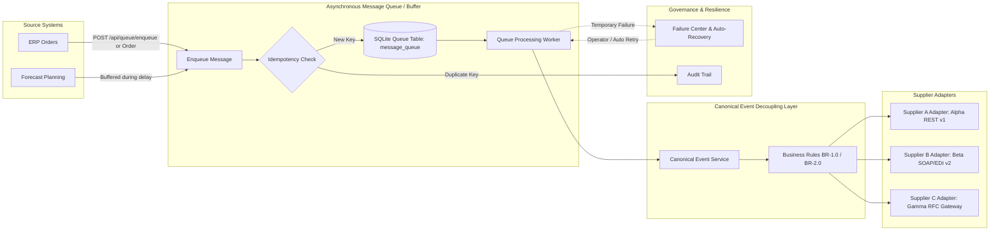

# Asynchronous Message Queue & Buffering Resilience Architecture

## 1. Overview & Purpose
In supply chain integration environments, source and destination systems (e.g. SAP S/4HANA ERP, BlueYonder Forecast Planning, Supplier APIs) often experience temporary downtime, scheduled batch ETL delays, network latency spikes, or burst throughput.

The **Asynchronous Message Queue & Buffer** strengthens the Integration Decoupling Pilot by:
1. Buffering incoming messages when upstream or downstream systems report degradation or delay.
2. Providing non-blocking queueing so order pipelines continue uninterrupted during forecast delays.
3. Automatically triggering retries upon temporary network timeouts.
4. Protecting message integrity through unique idempotency keys.
5. Providing full visibility into message queues, retries, and dead letters within the Integration Control Tower and Failure Center.

---

## 2. Architecture & Queue Flow

### Queue Lifecycle States
- **`QUEUED`**: The message has entered the buffer and is awaiting worker processing.
- **`PROCESSING`**: A worker is currently validating, canonicalizing, or transmitting the payload.
- **`PROCESSED`**: The message was successfully canonicalized, dispatched, and confirmed.
- **`RETRYING`**: A temporary failure (e.g. HTTP 503, gateway timeout) occurred; retry count has incremented and backoff is scheduled.
- **`FAILED` / `DEAD_LETTER`**: Maximum configured retries (`max_retries=3`) exhausted; failure is preserved in Failure Center for manual operator review or dead-letter replay.

---

## 3. Retry and Recovery Mechanism

1. **Transient Fault Interception**:
   During `process_message()`, if downstream transmission encounters an exception (e.g. `ConnectionError`, `503 Service Unavailable`, or target status `OFFLINE`), the worker captures the error.
2. **State & Retry Counter Management**:
   The message status is updated to `RETRYING` and `retry_count` is incremented.
3. **Failure Center Visibility**:
   A corresponding `FailureCase` record is created or linked in SQLite with `status="OPEN"`. Operators see the failure immediately in the Failure Center UI.
4. **Recovery Execution**:
   When the target system returns online (or during scheduled retry intervals), `retry_message()` or `/api/queue/retry/{queue_id}` executes re-transmission.
   Upon success:
   - Message transitions to `PROCESSED`.
   - The associated `FailureCase` transitions to `RESOLVED` with `resolved_at` timestamp.
   - An audited `MESSAGE_RECOVERED` entry is permanently logged.

---

## 4. Idempotency Protection

In high-throughput, multi-supplier networks, network retries frequently resend identical messages.
- Every message may specify an `idempotency_key` (e.g. `IDEMP-ORD-1001` or `IDEMP-Q-TEST-001`).
- The queue worker verifies the key against existing records before queueing or processing.
- If a match is detected:
  - The duplicate is safely rejected/ignored (`DUPLICATE_IGNORED`).
  - No redundant order, canonical event, or supplier delivery is generated.
  - An audit record with action `DUPLICATE_DETECTED` and severity `WARNING` is created.

---

## 5. Supplier Adapter Schema Contracts & Validation

Supplier input messages are enforced using explicit Pydantic contract models:
- **Supplier A (Alpha Components)**: `SupplierAInboundOrder` enforces `orderNumber`, `itemCode`, positive integer `qty`, `dispatchPriority`, and ISO `targetDelivery`.
- **Supplier B (Beta Manufacturing)**: `SupplierBInboundOrder` enforces `poRef`, `partNumber`, positive integer `orderedQuantity`, `urgencyLevel`, and `requestedDate`.
- **Supplier C (Gamma Parts)**: `SupplierCInboundOrder` enforces `ORDER_NO`, `SKU`, positive integer `QTY`, `EXPEDITE_FLAG`, and `SCHEDULE_DATE`.

### Validation Behavior
- **Valid Messages**: Accepted, converted to Canonical Event format via `transform_to_canonical()`, and evaluated against the active business rule (`BR-1.0` or `BR-2.0`).
- **Invalid Messages**: Rejected at the adapter boundary with HTTP 422 and a structured JSON list of specific field validation errors. Malformed data cannot pollute the canonical layer.

---

## 6. Relationship with Canonical Event Architecture

1. **Separation of Concerns**:
   - The **Message Queue / Buffer** provides asynchronous decoupling, shock absorption, and transport resilience.
   - The **Canonical Event Layer** owns the single source of truth for business events (`ORDER_CREATED`, `FORECAST_PUBLISHED`) and dynamic business rules (`URGENT_ORDER_THRESHOLD`).
   - The **Supplier Adapters** encapsulate wire formats and schema transformations for each supplier.
2. **Blast Radius Isolation**:
   If an adapter experiences an endpoint outage or schema error, only that supplier's queue items enter retry/dead-letter state. The central canonical core and other suppliers remain 100% operational.

---

## 7. Prototype Implementation & Known Limitations

- **Lightweight SQLite-Backed Implementation**:
  As requested for this prototype phase, the queue is implemented using an ACID-compliant SQLite table (`message_queue`) and FastAPI background processing abstractions rather than heavy external infrastructure (such as RabbitMQ, Apache Kafka, or Redis).
- **Concurrency**:
  In a high-scale production deployment, this queue abstraction would be backed by a distributed broker (e.g. Kafka or RabbitMQ) with distributed consumer groups and partition-based ordering guarantees.
- **Backoff Strategy**:
  Current retries use fixed-interval / on-demand retry triggers; production implementations would utilize jittered exponential backoff and dead-letter queue routing with alert triggers.
