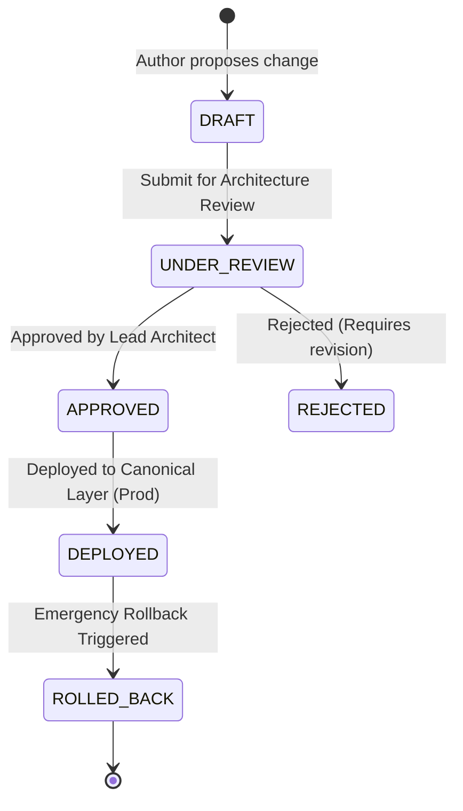

# Change Management Workflow & Governance (CR-001)

## 1. Overview
In enterprise manufacturing integrations, arbitrary rule changes introduce substantial operational risk. The Integration Control Tower establishes a formal, audited change promotion workflow to govern all modifications to canonical business logic.

---

## 2. Change Request Lifecycle States



### State Definitions
1. **`DRAFT`**: Author drafts proposed rule threshold, description, and impact rationale.
2. **`UNDER_REVIEW`**: Formally submitted for enterprise architecture review. Direct deployment is locked.
3. **`APPROVED`**: Authorized architect approves deployment. High-impact rule changes require this prerequisite state.
4. **`REJECTED`**: Reviewer rejects with explicit justification stored in audit notes.
5. **`DEPLOYED`**: Rule version activated in the runtime gateway (`BR-1.0` &rarr; `BR-2.0`).
6. **`ROLLED_BACK`**: Previous rule version safely reinstated.

---

## 3. Benchmark Change Request: CR-001

- **Change ID**: `CR-001`
- **Title**: Urgent Order Priority Volume Realignment
- **Rule Key**: `URGENT_ORDER_THRESHOLD`
- **Initial Baseline Rule (BR-1.0)**: Threshold = 100 Units
- **Target Proposed Rule (BR-2.0)**: Threshold = 200 Units
- **Business Rationale**: Restricts costly expedited freight handling fees by reserving priority status only for urgent orders meeting or exceeding 200 units.

### Blast Radius Comparison Under CR-001
- **Baseline Point-to-Point**: 6 distinct connector systems modified.
- **Decoupled Architecture**: 1 canonical business rule component modified (`canonical_event_service.py`).
- **Reduction Percentage**: **83.3%**.

---

## 4. Mandatory Approval Enforcement
The API enforces strict approval validation in `backend/app/services/change_service.py`:
```python
def deploy_change(db: Session, change_id: str, deployer: str):
    cr = get_change_by_id(db, change_id)
    if cr.status != "APPROVED":
        raise ValueError(f"Cannot deploy unapproved change! Current status is '{cr.status}'. Approval is strictly required.")
    ...
```
Attempting to bypass the approval state returns an immediate `HTTP 400 Bad Request`.
