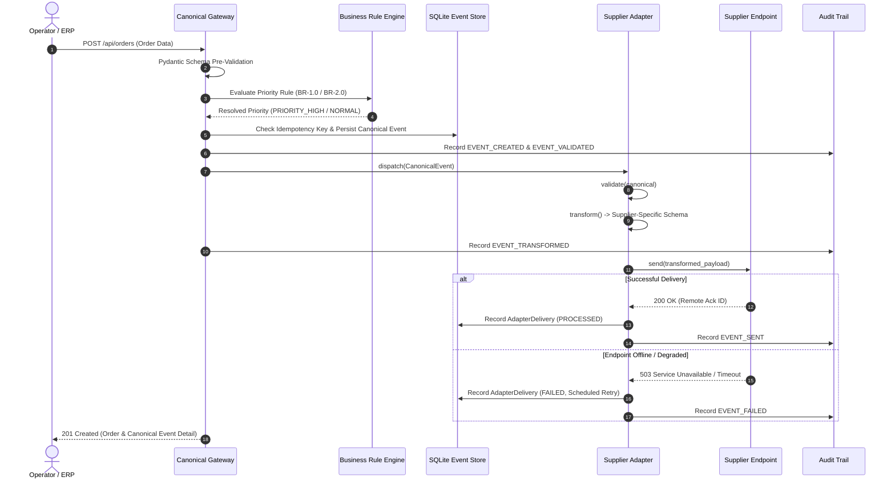

# Field-Level Workflow & Transformation Mapping

## 1. Overview
This document provides the field-level transformation matrix across the entire data pipeline: from source systems (ERP, Forecast Planning), through the Canonical Event Layer, and into the supplier-specific adapter schemas for Suppliers A, B, and C.

---

## 2. Order Field Mapping Matrix

| Canonical Field | Type | Description | Supplier A (Alpha) | Supplier B (Beta) | Supplier C (Gamma) |
| :--- | :--- | :--- | :--- | :--- | :--- |
| `order_id` | `string` | Unique order identifier | `orderNumber` | `poRef` | `ORDER_NO` |
| `supplier_id` | `string` | Target supplier code | Internal routing | Internal routing | Internal routing |
| `product_id` | `string` | Material / part SKU | `itemCode` | `partNumber` | `SKU` |
| `quantity` | `integer` | Purchased volume | `qty` (integer) | `orderedQuantity` (int) | `QTY` (integer) |
| `unit` | `string` | Unit of measure (`EA`, `SET`) | Implicit in itemCode | Implicit in partNumber | Implicit in SKU |
| `priority` | `string` | Computed rule priority | `dispatchPriority` (`EXPEDITED` / `STANDARD`) | `urgencyLevel` (`CRITICAL` / `ROUTINE`) | `EXPEDITE_FLAG` (`true` / `false`) |
| `delivery_date` | `string` | Target delivery ISO date | `targetDelivery` (YYYY-MM-DD) | `requestedDate` (YYYY-MM-DD) | `SCHEDULE_DATE` (YYYY-MM-DD) |
| `business_rule_version`| `string` | Active rule version | Tagged in metadata | Tagged in auditMeta | Tagged in GATEWAY_HEADER |
| `correlation_id` | `string` | End-to-end trace UUID | `metadata.correlationId` | `auditMeta.correlationId`| `GATEWAY_HEADER.CORR_ID` |

---

## 3. Priority Rule Transformation Logic

The priority attribute is derived in the Canonical Event Layer based on active rule versions:

### Rule BR-1.0 (Baseline Initial State)
```python
if order.is_urgent and order.quantity >= 100:
    priority = "PRIORITY_HIGH"
else:
    priority = "NORMAL"
```

### Rule BR-2.0 (Post CR-001 Deployment)
```python
if order.is_urgent and order.quantity >= 200:
    priority = "PRIORITY_HIGH"
else:
    priority = "NORMAL"
```

### Adapter Priority Translation Table

| Canonical Priority | Supplier A (`dispatchPriority`) | Supplier B (`urgencyLevel`) | Supplier C (`EXPEDITE_FLAG`) |
| :--- | :--- | :--- | :--- |
| `PRIORITY_HIGH` | `"EXPEDITED"` | `"CRITICAL"` | `True` |
| `NORMAL` | `"STANDARD"` | `"ROUTINE"` | `False` |

---

## 4. Forecast Field Mapping Matrix

| Canonical Field | Type | Description | Supplier A (Alpha) | Supplier B (Beta) | Supplier C (Gamma) |
| :--- | :--- | :--- | :--- | :--- | :--- |
| `forecast_id` | `string` | Demand projection ID | `alphaForecastId` | `forecastRef` | `FCST_IDENTIFIER` |
| `product_id` | `string` | Component part code | `componentSku` | `partNumber` | `PART_ID` |
| `forecast_quantity` | `integer` | Projected units | `projectedVolume` | `projectedQty` | `DEMAND_QTY` |
| `forecast_period` | `string` | Quarter or month | `planningHorizon` | `timeBucket` | `BUCKET_PERIOD` |
| `confidence_level` | `float` | Model confidence | `confidenceScore` | `accuracyRating` | `ACCURACY_INDEX` |
| `source_system` | `string` | Originating tool | Tagged in header | Tagged in header | Tagged in header |

---

## 5. End-to-End Processing Workflow


